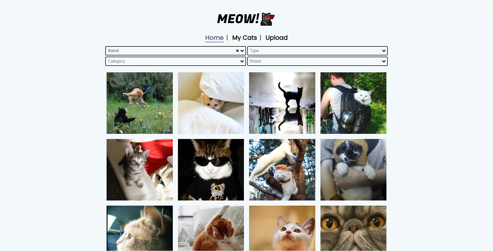

# The Cat App 🐱‍👤
<!-- ALL-CONTRIBUTORS-BADGE:START - Do not remove or modify this section -->

<!-- ALL-CONTRIBUTORS-BADGE:END -->
### _For all your meowy needs!_

## Features
- Haven't got your dose of kitty photos for the day? Scroll all the cat photos you want and filter them by breed, type (static or animated) or category __(hmmm...🤔)__
- Wonder what do cats dream of at night? find out using the **DEEP DREAM BUTTON!** 🌌
- Cats are cool, but you know what makes them cooler? the **COOL BUTTON**  knows what's hip and cool and it'll definetly make your cats up there coolness game 🕶
- Fed up with all the amount of __memes__ you see all day? don't fret, the next level of __memeiness__ is here with the **MEMEOW BUTTON!** 🎭
- Have a local stash of your cat photos? upload them to **The Cat App** to share all the meowy goodness (don't try to upload your adorable puppy photos cause we'll know 👀)

## Contributors ✨

Thanks goes to these wonderful people ([emoji key](https://allcontributors.org/docs/en/emoji-key)):

<!-- ALL-CONTRIBUTORS-LIST:START - Do not remove or modify this section -->
<!-- prettier-ignore-start -->
<!-- markdownlint-disable -->
<!-- markdownlint-restore -->
<!-- prettier-ignore-end -->
<!-- ALL-CONTRIBUTORS-LIST:END -->

This project follows the [all-contributors](https://github.com/all-contributors/all-contributors) specification. Contributions of any kind welcome!